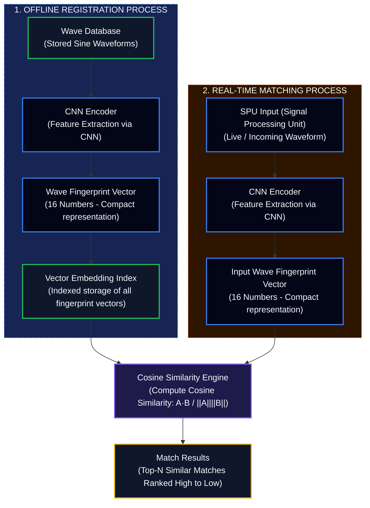

# AegisCSI Hospital Monitor

AegisCSI is a state-of-the-art clinical Wi-Fi Channel State Information (CSI) patient monitoring system. It leverages ESP32 nodes to capture real-time physical perturbations, passes them through a signal processing pipeline, feeds them to machine learning classifiers, and visualizes live activity, diagnostics, and critical fall alerts on a secure, responsive hospital dashboard.

---

## Wave Similarity Matching System Architecture



---

## Project Structure

- `backend/`: FastAPI REST + WebSocket Server
  - `app/signal_processing/`: CSI parsing, amplitude/phase extraction, lowpass Butterworth filtering, and temporal windowing.
  - `app/models.py`: Database models mapped via SQLAlchemy (supports SQLite & PostgreSQL).
  - `app/ml_inference.py`: Fallback ML Classifier executing stateful motion energy calculations.
  - `app/fall_logic.py`: Logic checking for motion-energy spikes and stillness transitions.
  - `app/alert_sweeper.py`: Background worker monitoring the 15-second verification window.
  - `app/main.py`: Main routes, WebSocket live broadcasts, and seeding logic.
  - `esp32-bridge/esp_bridge.py`: Relay client for hardware or multi-device simulation.
- `extracted_frontend/aegis-csi-hospital-monitor/`: React + TypeScript frontend dashboard rewired to consume backend REST APIs and live WebSockets.

---

## Quick Start (Hardware-Free Demo Mode)

To run the application locally without physical ESP32 sensors, follow these instructions to spin up the mock network.

### 1. Set Up and Run the Backend

Navigate to the root workspace directory, configure a Python virtual environment, install the dependencies, and start the FastAPI server:

```bash
# Create and activate Python virtual environment
python3 -m venv venv
source venv/bin/activate

# Install backend dependencies
pip install -r backend/requirements.txt

# Start the FastAPI server (runs on port 8000 by default)
python3 -m uvicorn backend.app.main:app --reload --host 0.0.0.0 --port 8000
```

On first startup, the backend automatically initializes an SQLite database (`aegis_csi.db`) and seeds it with 32 clinical rooms, devices, model versions, users, roles, and a genesis hash-chained audit entry.

---

### 2. Set Up and Run the Frontend

In a new terminal window, build and start the React application using Vite:

```bash
# Navigate to the frontend folder
cd extracted_frontend/aegis-csi-hospital-monitor

# Install frontend node modules (if not already installed)
npm install

# Start Vite dev server (runs on port 5173 by default)
npm run dev
```

Open your browser to `http://localhost:5173`. Select any user (e.g. Nurse Sarah Jenkins or Dr. Arun Kumar) from the drop-down menu and log in. You will see the Live Dashboard. Initially, the room states will show `no_movement` as no packets are flowing.

---

### 3. Spin Up the ESP32 CSI Bridge Simulator

In a third terminal window, start the bridge simulator. It generates live, fluctuating CSI waveforms for all 32 rooms and automatically schedules random fall scenarios to demonstrate the alert workflow:

```bash
# Ensure you are in the workspace root and your venv is active
source venv/bin/activate

# Run the bridge in simulation mode
python backend/esp32-bridge/esp_bridge.py --simulate
```

The bridge will begin POSTing packets to the backend, which will process them, save waveforms to the DB, run the ML predictions, and broadcast updates to your React browser window. You will see CSI subcarrier amplitudes fluctuate in real time under the "Technical View" of any room, and occasional "Verifying" alerts will slide open, converting to "Confirmed" after 15 seconds of stillness, or "Resolved" if they stand back up.

---

## Physical Hardware Deployment

To connect a real ESP32 CSI provider running the CSI firmware:

1. Connect the ESP32 node to your computer via USB.
2. Verify the serial port name (e.g. `COM7` on Windows, or `/dev/ttyUSB0` on Linux/macOS).
3. Stop the simulator and run the bridge pointing to the physical port:

```bash
python backend/esp32-bridge/esp_bridge.py --port /dev/ttyUSB0
```

The bridge will now read serial lines directly from the device, parse the packet metadata, and POST them to the backend ingest server in real-time.
