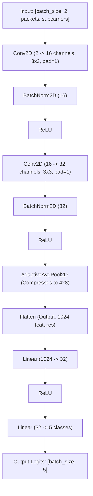

# ONNX Model Details: `csi_model.onnx`

This document provides the complete technical specifications, input/output tensor configurations, layer architecture, and execution details for the exported ONNX model representation of the Channel State Information (CSI) classifier.

---

## 1. Model Metadata

| Property | Value |
| :--- | :--- |
| **Model Filename** | `csi_model.onnx` |
| **Export Format** | ONNX (Open Neural Network Exchange) |
| **ONNX Opset Version** | 18 |
| **Framework Source** | PyTorch 2.x |
| **Target Task** | Human Activity Recognition (HAR) via Wi-Fi Sensing |
| **Optimizations** | Constant Folding enabled |

---i

## 2. Input and Output Tensors

The model is exported with **dynamic axes** for the inputs and outputs, meaning it can process variable batch sizes and dynamically sized CSI matrices without recompilation.

### Input Tensor (`input`)
* **Data Type**: `Float32`
* **Shape**: `[batch_size, 2, packets, subcarriers]`
  * `batch_size`: Dynamic (e.g., `1` for real-time inference, `N` for batch processing).
  * `2`: Channels representing **Amplitude** (Channel 0) and **Phase** (Channel 1).
  * `packets`: Dynamic temporal window length (e.g., `50` packets per sample).
  * `subcarriers`: Dynamic frequency subcarrier count (e.g., `56` for 20MHz bandwidth, `114` for 40MHz bandwidth).

### Output Tensor (`output`)
* **Data Type**: `Float32`
* **Shape**: `[batch_size, 5]`
  * Output logits (raw classifier scores) for each of the 5 classification classes.

---

## 3. Classification Classes

The output tensor index maps to the following activities:

| Index | Class Name | Description |
| :---: | :--- | :--- |
| **0** | `Standing` | Person is stationary and upright. Stable signal amplitude/phase. |
| **1** | `Sitting` | Person is seated and still. Lower overall signal amplitude. |
| **2** | `Walking` | Periodic fluctuations (1.5 Hz) from arm and leg movements. |
| **3** | `Running` | High-frequency, large-amplitude signal fluctuations. |
| **4** | `Falling` | Sudden high-energy spike followed by a drop to near-zero amplitude. |

---

## 4. Model Architecture & Layer Flow

The network is a 2D Convolutional Neural Network that uses an Adaptive Pooling layer to compress variable input sizes into a fixed feature representation.



---

## 5. Runtime Integration Guide (Python Example)

To execute inference using the ONNX model, you can use the lightweight `onnxruntime` library.

```python
import numpy as np
import onnxruntime as ort

# 1. Load the ONNX model session
session = ort.InferenceSession("csi_model.onnx")

# 2. Prepare sample CSI input (batch_size=1, channels=2, packets=50, subcarriers=114)
# Channel 0: Amplitude, Channel 1: Phase
amplitude = np.random.rand(50, 114).astype(np.float32)
phase = np.random.rand(50, 114).astype(np.float32)
combined_input = np.stack([amplitude, phase], axis=0)  # Shape: (2, 50, 114)
network_input = np.expand_dims(combined_input, axis=0)  # Shape: (1, 2, 50, 114)

# 3. Perform inference
inputs = {session.get_inputs()[0].name: network_input}
outputs = session.run(None, inputs)

# 4. Process predictions
logits = outputs[0]  # Shape: (1, 5)
predicted_class_id = np.argmax(logits, axis=1)[0]

classes = ["Standing", "Sitting", "Walking", "Running", "Falling"]
print(f"Predicted Activity: {classes[predicted_class_id]}")
```
